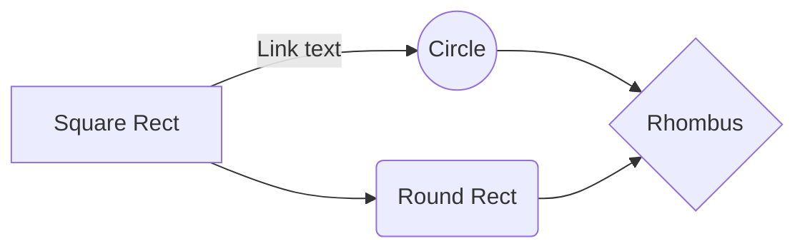

# StackEdit Markdown Reference file

Lorem Ipsum

|afa  |asf  | ey| ertre| wrtwrT|  g| d |
|--|--|--|--|--|--|--|
|  g| d |  g| d |a |  g| d |

<!--  -->


``` const varname = AOS.init();  ```

# Files

lorem Ipsum

## UML diagrams

You can render UML diagrams using [Mermaid](https://mermaidjs.github.io/). For example, this will produce a flowchart:


